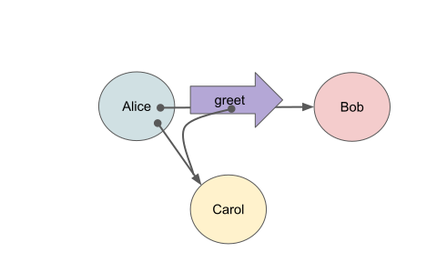

# Awesome Object Capabilities and Capability-based Security

Capability-based security enables the concise composition of powerful
[patterns of cooperation without vulnerability](https://github.com/dckc/awesome-ocap/wiki).

 - Tech you can use
   - [Applications and Services](#app-svc)
   - [Libraries and Frameworks](#lib)
   - [Programming Languages](#lang)
   - [Operating Systems](#os)
   - [CPUs and embedded devices](#cpu)
 - Learn, Watch, Read
   - [Presentations, Talks, Slides, and Videos](#talk)
   - [Articles](#article)
     - [Peer-reviewed Articles](#lit)

In 3 minutes:

  - [Opening Statement on SOSP 50th Anniversary Panel](https://www.youtube.com/watch?v=br9DwtjqmVI) Mark Miller

In 15 minutes:

  - [Navigating the Attack Surface to achieve a *multiplicative* reduction in risk](https://www.youtube.com/watch?v=wW9-KuezPp8&t=664s)

Or for a detailed explanation: [What Are Capabilities?](http://habitatchronicles.com/2017/05/what-are-capabilities/) by Morningstar in 2017.

## Applications and Services

  - [Cloudflare Workers](https://developers.cloudflare.com/workers/)
    - 2024-04: [We’ve added JavaScript-native RPC to Cloudflare Workers](https://blog.cloudflare.com/javascript-native-rpc/) – Kenton Varda introduces a secure, ergonomic RPC mechanism built into the Workers platform, enabling structured, streamed, bidirectional communication between components with Cap’n Proto-style semantics and ocap-aligned design

    - 2024-04: [Why Workers environment variables contain live objects](https://blog.cloudflare.com/workers-environment-live-object-bindings)
    - 2022-09: [Introducing workerd: the Open Source Workers runtime](https://blog.cloudflare.com/workerd-open-source-workers-runtime/)
    - 2021-10: [Dynamic Process Isolation: Research by Cloudflare and TU Graz](https://blog.cloudflare.com/spectre-research-with-tu-graz/)
    - 2021-08: [Durable Objects: Easy, Fast, Correct — Choose three](https://blog.cloudflare.com/durable-objects-easy-fast-correct-choose-three/)
    - 2020-07: [Mitigating Spectre and Other Security Threats: The Cloudflare Workers Security Model](https://blog.cloudflare.com/mitigating-spectre-and-other-security-threats-the-cloudflare-workers-security-model/)
  - [Sandstorm](https://sandstorm.org/) is a self-hosted web
    productivity suite and [App Market](https://apps.sandstorm.io/)
    with WordPress, Rocket.Chat, IPython Notebook and many more.
    [Sandstorm's Capability-based Security][scap] protects you and
    your data against application bugs.
    - 2024-01: [Sandstorm now belongs to Sandstorm.org](https://sandstorm.io/news/2024-01-14-move-to-sandstorm-org)
    - 2023-10: [Sandstorm, Tempest, and the Future](https://sandstorm.org/news/2023-10-23-sandstorm-tempest-and-the-future)
    - 2020-02-22: [Announcing the release of vagrant\-spk 1\.0](https://sandstorm.io/news/2020-02-22-announcing-vagrant-spk-1.0)
    - 2017-03-02: [connecting to external HTTP APIs via the Powerbox](https://github.com/sandstorm-io/sandstorm/pull/2870)
      and related powerbox enhancements  
      v0.200 (2017-01-28), v0.203
    - 2015-02-06: [One click to try an open source web application][1502] 
  - [Tahoe-LAFS](https://tahoe-lafs.org/) is a highly available
    decentralized cloud storage system. Even if some of the servers
    fail or are taken over by an attacker, the entire file store
    continues to function correctly, preserving your privacy and
    security.
    - 2024-12: [v1.20.0 is released]https://lists.tahoe-lafs.org/pipermail/tahoe-dev/2024-December/010111.html)
    - 2024-01-01 [v1.19.0 released](https://lists.tahoe-lafs.org/pipermail/tahoe-dev/2024-January/010064.html)
    - 2023-11: [new work on a Haskell client implementation](https://hackage.haskell.org/package/tahoe-great-black-swamp)
    - 2020-02: [Tahoe-LAFS Summit at PyCon2020](https://tahoe-lafs.org/pipermail/tahoe-dev/2020-February/009983.html)

[scap]: https://sandstorm.io/how-it-works#capabilities
[1407]: https://sandstorm.io/news/2014-07-21-open-source-web-apps-require-federated-hosting
[1502]: https://sandstorm.io/news/2015-02-06-app-demo

## Libraries and Frameworks

  - JavaScript
    - [cloudflare/workerd: The JavaScript / Wasm runtime that powers Cloudflare Workers](https://github.com/cloudflare/workerd)
      - 2025-01: [Release v1\.20250108\.0 · cloudflare/workerd](https://github.com/cloudflare/workerd/releases/tag/v1.20250108.0)
      - 2022-09: [Introducing workerd: the Open Source Workers runtime](https://blog.cloudflare.com/workerd-open-source-workers-runtime/)
    - [Hardened JavaScript](https://hardenedjs.org/) "Hardened JavaScript is a standards track mode for the JavaScript language for safe plugin systems and supply chain attack resistance. Hardening JavaScript improves a program’s integrity in the face of adversarial code in the same process."
      - 2024-10 [SES 1.9.0 introduces immutable ArrayBuffers](https://hardenedjs.org/blog/ses-1.9.0/)
      - 2023-09 [Decentralizing the wallet experience with MetaMask Snaps](https://metamask.io/news/latest/decentralizing-the-wallet-experience-with-metamask-snaps/)
      - 2021-09: SES-0.14.3 `6190052`
      - 2020-03: SES-0.7.6 `9385d44`
      - 2019-12: [Making 'npm install' Safe \- QCon New York](https://www.youtube.com/watch?v=hP00w4r4zhg&list=PLzDw4TTug5O0ywHrOz4VevVTYr6Kj_KtW&index=22) "Kate Sills on security issues using NPM packages, the EventStream incident, and SES" as possible solutions to npm supply-chain risks.
      - 2019-06: [Higher\-order Smart Contracts across Chains](https://www.youtube.com/watch?v=iyuo0ymTt4g&list=PLhuBigpl7lqth_Ow_eQWZs7NFxmeDw9W8&index=1) Agoric \+ Protocol Labs //  \- Mark Miller
      - 2018-10-15: [SF Cryptocurrency Devs: Agoric \- Programming Secure Smart Contracts](https://www.youtube.com/watch?v=YXUqfgdDbr8)
      - 2018-07-28: [Agoric Releases SES: Secure JavaScript](https://agoric.com/agoric-releases-ses/)  f4d3d5a
    - [LavaMoat/LavaMoat: tools for sandboxing your dependency graph](https://github.com/LavaMoat/LavaMoat)
      - 2024-12: [Release lavamoat: v9.0.5](https://github.com/LavaMoat/LavaMoat/releases/tag/lavamoat-v9.0.5)
      - 2022-11: [The Attacker is Inside: Javascript Supplychain Security and LavaMoat](https://www.youtube.com/watch?v=Z5Bz0DYga1k&t=14s) by kumavis at Ethereum Devcon Bogota
      - 2021-01: [Speakeasy JS – Lavamoat: Securing your dependency graph \(Kumavis\)](https://www.youtube.com/watch?v=iaqe6F4S2tA)
    - [The Syndicated Actor Model](https://git.syndicate-lang.org/syndicate-lang/syndicate-js)
  - C / C++
      - [Cap’n Proto](https://capnproto.org/) is a high performance
        serialization and RPC protocol with distributed and persistent
        capabilities and promise pipelining. Bindings to python,
        JavaScript (in node.js), Go, Rust, etc. are available
        - 2020-04-23: [Cap'n Proto: Cap'n Proto 0\.8: Streaming flow control, HTTP\-over\-RPC, fibers, etc\.](https://capnproto.org/news/2020-04-23-capnproto-0.8.html)
        - 2014-12-15: [Cap'n Proto 0.5, and how it is central to Sandstorm][1412] by Kenton Varda
      - [Moddable SDK](https://github.com/Moddable-OpenSource/moddable) - "Tools for developers to create truly open IoT products using standard JavaScript on low cost microcontrollers."
        - 2024-12: [Release Moddable SDK 5.3.3](https://github.com/Moddable-OpenSource/moddable/releases/tag/5.3.3)
  - Scheme (guile, racket)
      - [Spritely Goblins](https://spritely.institute/goblins/) - "distributed object programming environment. Goblins provides an intuitive security model, automatic local transactions for locally synchronous operations, and an easy to use and efficient asynchronous programming interface for encapsulated objects which can live anywhere on the network. Its networking model abstracts away these details so the programmer can focus on object programming rather than protocol architecture."

        - 2025-03: [Spritely Goblins v0.15.1
          Released](https://www.spritely.institute/news/spritely-goblins-v0-15-1-released.html)
          "a quality release focused on polish, fixing bugs in CapTP
          GC, message handling in persistent vats, and netlayer
          reconnection; also adds a `timeout` helper and improved
          `race*` joiner"

        - 2025-01: [Spritely Goblins v0.15.0: Goblins in the
          Browser](https://spritely.institute/news/spritely-goblins-v0-15-0-goblins-in-the-browser.html)
          "Goblins code can now be compiled to WebAssembly and run in
          the browser, with a WebSocket netlayer and `goblin-chat`
          demo; includes major performance boosts"

        - 2024-09: [Spritely Goblins v0.14.0: libp2p and Improved
          Persistence](https://spritely.institute/news/spritely-goblins-v0-14-0-libp2p-and-improved-persistence.html)
          "introduces a libp2p netlayer, cross-vat persistence using
          `^persistence-registry`, self-referential actors with
          `#:self`, and actor upgrade macros"

        - 2024-05 [Distributed System Daemons: More Than a Twinkle in
          Goblins' Eye — Spritely
          Institute](https://spritely.institute/news/spritely-nlnet-grants-december-2023.html)
          "a port of the GNU Shepherd system layer to Guile Goblins —
          the first step in making Guix the object-capability
          operating system!"

        - 2024-04: [Spritely Goblins v0.13.0: Object Persistence and
          Easier
          IO](https://spritely.institute/news/spritely-goblins-v0-13-0-object-persistence-and-easier-io.html)
          "introduces the Aurie persistence system for long-lived
          objects, simplifies actor definition with `define-actor`,
          and adds the `^io` actor for asynchronous IO"

        - 2024-05 [Distributed System Daemons: More Than a Twinkle in Goblins' Eye — Spritely Institute](https://spritely.institute/news/spritely-nlnet-grants-december-2023.html) "a port of the GNU Shepherd system layer to Guile Goblins — the first step in making Guix the object-capability operating system!"
        - 2022-10 [NLnet grant bootstraps OCapN protocol standardization effort](https://spritely.institute/news/nlnet-grant-bootstraps-ocapn-protocol-standardization-effort.html)
        - 2021-07 [Content Addressed Descriptors and Interfaces with Spritely Goblins paper](https://spritelyproject.org/news/content-addressed-descriptors-paper.html) "how to perform "conversational" programming in Spritely Goblins, or any other system which assumes a mutually suspicious network. ... The reason this system is able to be elegantly embedded in a network environment is its use of Spritely's implementation of CapTP."
        - 2020-05-13 [Spritely's NLNet grant: Interface Discovery for Distributed Systems \-\- DustyCloud Brainstorms](https://dustycloud.org/blog/spritely-nlnet-grant/)
      - [Shill](http://shill-lang.org): Shill is a shell scripting
        language designed to make it easy to follow the Principle of Least
        Privilege. It runs on FreeBSD and is developed in Racket.
        - [Shill: A Secure Shell Scripting Language][shill-osdi]. Scott
          Moore, Christos Dimoulas, Dan King, and Stephen Chong. 11th
          USENIX Symposium on Operating Systems Design and Implementation
          (OSDI), October 2014.
      - [The Syndicated Actor Model](https://git.syndicate-lang.org/syndicate-lang/syndicate-rkt)

[shill-osdi]: http://shill.seas.harvard.edu/shill-osdi-2014.pdf
  - Scala
      - [ocaps](https://tersesystems.github.io/ocaps) is a library for working with object capabilities in Scala.
         * Revoker / Revocable classes for revoking capabilities.
         * Brand for sealing and unsealing capabilities
         * PermeableMembrane for revocation as an effect.
         * Macros for composition, attenuation, revocable and modulating capabilities.
      - Comes with a [guide to capabilities](https://tersesystems.github.io/ocaps/guide/index.html)
         - 2018-06-20 v0.1.0 released
         - 2018-09-22 [Presentation at Scaladays](https://slideslive.com/38908776/security-with-scala-refined-types-and-object-capabilities?subdomain=false)
  - rust
    - [cap-std](https://github.com/sunfishcode/cap-std) Capability-oriented version of the Rust standard library
      - 2022-11: [Release v1\.0\.0 · bytecodealliance/cap\-std](https://github.com/bytecodealliance/cap-std/releases/tag/v1.0.0)
    - [capnproto/capnproto\-rust: Cap'n Proto for Rust](https://github.com/capnproto/capnproto-rust)
      - 2022-11: [Release capnpc\-v0\.15\.0 · capnproto/capnproto\-rust](https://github.com/capnproto/capnproto-rust/releases/tag/capnpc-v0.15.0)
    - [Using Capabilities to Design Safer, More Expressive APIs](https://web.archive.org/web/20180903114550/https://zsck.co/writing/capability-based-apis.html)
      Zack Mullaly Jan 19, 2018
    - [The Syndicated Actor Model](https://git.syndicate-lang.org/syndicate-lang/syndicate-rs)
  - go
    - [capnproto/go\-capnproto2: Cap'n Proto library and code generator for Go](https://github.com/capnproto/go-capnproto2)
      - 2019-12: [Release v2\.18\.0 · capnproto/go\-capnproto2](https://github.com/capnproto/go-capnproto2/releases/tag/v2.18.0)
  - python
    - [Network protocols, sans I/O](http://sans-io.readthedocs.io/) supports
      object capability discipline by letting the caller handle network access.
    - [The Syndicated Actor Model](https://git.syndicate-lang.org/syndicate-lang/syndicate-py)
  - nim
    - [The Syndicated Actor Model](https://git.syndicate-lang.org/ehmry/syndicate-nim)

[1412]: https://sandstorm.io/news/2014-12-15-capnproto-0.5

## Programming Languages

  - [Pony](http://www.ponylang.org/) is an open-source,
    object-oriented, actor-model, capabilities-secure, high
    performance programming language.
    - March 22, 2019: 0.28.0 Released 0e67d08
    - bootstrapped using LLVM on x86 and ARM; packaged for linux and Mac OS X
    - docker images: [ponylang](https://hub.docker.com/u/ponylang/)
    - [Fully concurrent garbage collection of actors on many-core machines][237]  
      S. Clebsch and S. Drossopoulou  
      OOPSLA 2013

  - [Austral](https://austral-lang.org/) - a systems language with linear types and capability security
    - 2022-09: [Release 0\.1\.0: Core language complete](https://github.com/austral/austral/releases/tag/v0.1.0)

  - [Newspeak](https://newspeaklanguage.org/) is an object-capability programming platform that lets you develop code in your web browser. Like Self, Newspeak is message-based; all names are dynamically bound. However, like Smalltalk, Newspeak uses classes rather than prototypes.
    The current version of Newspeak runs on top of WASM.
    - 2021-09: [Gilad Bracha: Newspeak on the Web](https://www.youtube.com/watch?v=SG08kxIIlHQ&t=1083s) at California Smalltalkers
    - 2021-03: [Live IDEs in the Web Browser: What's Holding Us Back](https://www.youtube.com/watch?v=CJX_6B24Hho) Includes a brief demo of the WASM based Newspeak IDE.

  - [Monte](http://www.monte-language.org/) is a nascent dynamic
    programming language reminiscent of Python and E. It is based upon
    _The Principle of Least Authority_ (POLA), which governs
    interactions between objects, and a _capability-based object
    model_, which grants certain essential safety guarantees to all
    objects.
    - bootstrapped from rpython (pypy toolchain) and libuv and
    libsodium using (primarily) the nix build system.
    - Docker images: [montelang](https://hub.docker.com/r/montelang/)
    - 2017-03: [Monte: A Spiritual Successor to E](https://www.youtube.com/watch?v=FJnck8bgmXg&list=PLCq8mSCP664TUdgHl1cD5sDiAmrDoio2p) presented by Corbin Simpson at OCAP 2017

  - [Cadence](https://developers.flow.com/cadence) is a smart contract language with resources (linear types) and capability security.
    Its static type system has direct support for object-capability security. For example, the facade pattern is natively supported, and the type system has special down-casting rules to express access control patterns.

## Operating Systems

  - [genode](https://genode.org/) is a novel OS architecture that is
    able to master the complexity of code and policy -- the most
    fundamental security problem shared by modern general-purpose
    operating systems -- by applying a strict organizational structure
    to all software components including device drivers, system
    services, and applications.

    - 2025-04: [Sculpt OS release 25.04](https://genode.org/news/sculpt-os-release-25.04) – introduces multi-monitor window management and display rotation, integrates Chromium WebEngine 112, and extends hardware support to Intel Meteor Lake and F&S i.MX8MP armStone boards

    - 2025-02: [Genode OS Framework release 25.02](https://genode.org/news/genode-os-framework-release-25.02) – extends multi-monitor capabilities to window management and virtual machines, ports QEMU and Chromium WebEngine 112, boosts graphics performance via SIMD optimizations

    - 2024-11: [Genode OS Framework release 24.11](https://genode.org/news/genode-os-framework-release-24.11) – multi-monitor display support and the *Genode Applications* book signal a maturity milestone for desktop use

    - 2024-05: [Genode OS Framework release 24.05](https://genode.org/news/genode-os-framework-release-24.05) – Sculpt OS now runs on Genode’s custom kernel and gains GDB debugging support; USB stack redesigned

    - 2020-06: [Re-stacking the GUI stack](https://genodians.org/nfeske/2020-06-23-gui-stack) – Norman Feske outlines a redesign of Genode's GUI architecture, inverting the traditional client-server relationship between GUI servers and drivers to enhance resilience and modularity

    - 2020-05-28 [Genode OS Framework 20.05](https://genode.org/documentation/release-notes/20.05) with [Capability-based security using seccomp on Linux](https://genode.org/documentation/release-notes/20.05#Capability-based_security_using_seccomp_on_Linux), ...
    - 2018-02: [On-target package installation and deployment](https://genode.org/documentation/release-notes/18.02#On-target_package_installation_and_deployment) – introduces a package management model where untrusted tools like `curl`, `libarchive`, and `GnuPG` are used within tightly confined compartments; a ~1000-line download manager orchestrates deployment without expanding the TCB

[1608]: https://genode.org/news/genode-os-framework-release-16.08
[1708]: https://genode.org/documentation/release-notes/17.08
[1711]: https://genode.org/news/genode-os-framework-release-17.11

  - [Fuchsia](https://fuchsia.dev/fuchsia-src/get-started) is
    a real-time operating system in development by Google since
    Aug 2016. It's based on a
    microkernel,
    [Zircon](https://fuchsia.dev/fuchsia-src/concepts/kernel),
    with a capability security model.
    - 2021-06 [cr0 blog: A few thoughts on Fuchsia security](https://blog.cr0.org/2021/06/a-few-thoughts-on-fuchsia-security.html) Julien Tinnes. _Sandboxing is trivial. In fact a new process with access to no capabilities_

    - 2025-04: [Fuchsia F26 release notes](https://fuchsia.dev/whats-new/release-notes/f26) – continues refinement of the component framework, emphasizing explicit capability routing, lifecycle control, and modular isolation between components

    - 2025-01: [Fuchsia F24 release notes](https://fuchsia.dev/whats-new/release-notes/f24) – introduces improvements in diagnostics scoping and structured logging, reinforcing least-authority principles in observability tooling

    - 2024-03: [Fuchsia OS powers all Nest Hub devices](https://9to5google.com/2024/03/01/fuchsia-16-nest-hub-whats-new) – Fuchsia’s capability-based component framework is now deployed across all Nest Hub models, replacing the legacy Cast OS; each system component runs with only the capabilities it is explicitly granted, demonstrating ocap principles at scale in a mainstream consumer product

    - 2020-11: [Fuchsia Component Framework](https://fuchsia.dev/fuchsia-src/concepts/components/v2/introduction) – Fuchsia’s core architectural model based on sandboxed components and explicit capability routing, offering a native implementation of capability-secure composition

    - 2020-06-09 [Playing Around With The Fuchsia Operating System](https://blog.quarkslab.com/playing-around-with-the-fuchsia-operating-system.html) - [Quarkslab's blog](https://blog.quarkslab.com/index.html)
    - 2017-05-08 [Google’s “Fuchsia” smartphone OS dumps Linux, has a wild new UI](https://arstechnica.com/gadgets/2017/05/googles-fuchsia-smartphone-os-dumps-linux-has-a-wild-new-ui/) Ars Technica

  - [seL4](https://sel4.systems/) is the world's first
    operating-system kernel with an end-to-end proof of implementation
    correctness and security enforcement; it is available as open
    source.
    - 2022-10: [seL4 Summit 2022](https://sel4.systems/Foundation/Summit/abstracts2022) Munich, Germany (hybrid), 10-13 Oct 2022
      - [2022-10: 4th seL4 Summit](https://www.youtube.com/watch?v=PDVMVSSpGOQ&list=PLtoQeavghzr3atxNQig-sLGbwoKBSVxGV) video playlist
    - 2021-10: [wasmedge-seL4](https://github.com/second-state/wasmedge-seL4) `fc25cae` Integrate WasmEdge with seL4  
      [demo video](https://www.youtube.com/watch?v=2Qu-Trtkspk)
    - 2021-08: [Ghost donates to the seL4 Foundation](https://sel4.systems/news/2021)
    - 2021-08: [Lotus Cars joins the seL4 Foundation](https://sel4.systems/news/2021)
    - 2021-08: [seL4 protects world's most secure drone from DEFCON hackers](https://sel4.systems/news/2021)
    - 2021-07: [Ghost Raises $100M for Breakthrough in Autonomous Driving Safety](https://driveghost.com/blog/breakthrough-autonomous-driving-safety)
    - 2020-05-25 [The seL4® Microkernel An Introduction](https://sel4.systems/About/seL4-whitepaper.pdf) Gernot Heiser
    - 2020-04-08: [seL4 developers create open source foundation to enable safer, more secure and more reliable computing systems \- CSIRO](https://www.csiro.au/en/News/News-releases/2020/seL4-developers-create-open-source-foundation)
    - [Getting started with seL4, CAmkES, and L4v: Dependencies](https://research.csiro.au/tsblog/getting-started-sel4-camkes-l4v-dependencies/) MAY 19, 2017
    - [seL4 on the Raspberry Pi 3](https://research.csiro.au/tsblog/sel4-raspberry-pi-3/) FEBRUARY 8, 2017
    - Gerwin Klein, June Andronick, Kevin Elphinstone, Toby Murray, Thomas Sewell, Rafal Kolanski and Gernot Heiser  
      [Comprehensive formal verification of an OS microkernel][AEMSKH_14]  
    - Thomas Sewell, Simon Winwood, Peter Gammie, Toby Murray, June Andronick and Gerwin Klein  
      [seL4 enforces integrity](https://citeseerx.ist.psu.edu/viewdoc/download?doi=10.1.1.220.4596&rep=rep1&type=pdf)  
      International Conference on Interactive Theorem Proving, pp. 325-340, Nijmegen, The Netherlands, August, 2011
      > Abstract. We prove the enforcement of two high-level access
      > control properties in the seL4 microkernel: integrity and
      > authority confinement.  Integrity provides an upper bound on
      > write operations. Authority con- finement provides an upper
      > bound on how authority may change. Apart from being a
      > desirable security property in its own right, integrity can be
      > used as a general framing property for the verification of
      > user-level system composition. The proof is machine checked in
      > Isabelle/HOL and the results hold via refinement for the C
      > implementation of the kernel.
  - [Capsicum](https://www.cl.cam.ac.uk/research/security/capsicum/)
    Capsicum is a lightweight OS capability and sandbox framework that
    extends the POSIX API, providing several new OS primitives to
    support object-capability security on UNIX-like operating systems
    - 2019-10 _Capsicum Update 2019_ by Mariusz Zaborski in [FreeBSD Journal: Security](https://www.freebsdfoundation.org/past-issues/security-3/)
    
    - 2017-07-19 [Capsicum Go support](https://lists.cam.ac.uk/pipermail/cl-capsicum-discuss/2017-July/msg00004.html) Ben Laurie
    - [Capsicum for FreeBSD](https://www.cl.cam.ac.uk/research/security/capsicum/freebsd.html)
    - [Capsicum for Linux](https://www.cl.cam.ac.uk/research/security/capsicum/linux.html)
    - Watson,
      R. N. M. [2013 Capsicum year in review](https://www.lightbluetouchpaper.org/2013/12/20/2013-capsicum-year-in-review/). Light
      Blue Touchpaper, 20 December, 2013. Robert Watson reviews
      Capsicum events from 2013: work funded by the FreeBSD Foundation
      and Google on FreeBSD 10.0, Casper in FreeBSD 11, David
      Drysdale's port of Capsicum to Linux at Google, Summer of Code
      students, joint work with the University of Wisconsin on
      Capsicum, and future funded Capsicum work.
  - [KataOS](https://github.com/AmbiML/sparrow-manifest) - embeded platform that runs on top of seL4
    - 2022-10: [Announcing KataOS and Sparrow \| Google Open Source Blog](https://opensource.googleblog.com/2022/10/announcing-kataos-and-sparrow.html) “As the foundation for this new operating system, we chose seL4 as the microkernel because it puts security front and center; it is mathematically proven secure, with guaranteed confidentiality, integrity, and availability.”

[AEMSKH_14]: https://trustworthy.systems/publications/nicta_full_text/7371.pdf

## CPUs and Embedded Devices

  - [Moddable](https://www.moddable.com/) "Moddable brings the JavaScript ecosystem to embedded software development"
    - 2024-07 [Introducing Moddable Six](https://www.moddable.com/blog/introducing-moddable-six/) "Moddable Six is for developers who want to use industry standard JavaScript to deliver dynamic IoT projects, especially those with a rich, mobile-style user experience."
  - [CHERI](https://www.cl.cam.ac.uk/research/security/ctsrd/) is an open source capability CPU design.
    - 2022-01 [Arm releases experimental CHERI-enabled Morello board as part of £187M UKRI Digital Security by Design programme](https://www.lightbluetouchpaper.org/2022/01/20/arm-releases-experimental-cheri-enabled-morello-board-as-part-of-187m-ukri-digital-security-by-design-programme/) CHERI implements architectural capabilities that directly enable software security features such as fine-grained memory protection and scalable software compartmentalisation — both important software vulnerability mitigation techniques that are not well supported on current processor architectures. ... memory-safe C compilation and linkage ...
    - 2019-09 [The Arm Morello Board](https://www.cl.cam.ac.uk/research/security/ctsrd/cheri/cheri-morello.html) Arm announced Morello, an experimental CHERI-extended, multicore, superscalar ARMv8-A processor, System-on-Chip (SoC), and prototype board to be available from late 2021. Morello is a part of the UKRI £187M Digital Security by Design Challenge (DSbD) supported by the UK Industrial Strategy Challenge Fund, including a commitment of over £50M commitment by Arm.
    - 2019-09 [An Introduction to CHERI](https://www.cl.cam.ac.uk/techreports/UCAM-CL-TR-941.pdf)
      > CHERI (Capability Hardware Enhanced RISC Instructions) extends conventional processor Instruction-Set Architectures (ISAs) with architectural capabilities to enable fine-grained memory protection and highly scalable software compartmentalization. CHERI’s hybrid capability-system approach allows architectural capabilities to be integrated cleanly with contemporary RISC architectures and microarchitectures, as well as with MMU-based C/C++- language software stacks.
      > 
      > CHERI’s capabilities are unforgeable tokens of authority, which can be used to implement both explicit pointers (those declared in the language) and implied pointers (those used by the runtime and generated code) in C and C++. When used for C/C++ memory protection, CHERI directly mitigates a broad range of known vulnerability types and exploit techniques. Support for more scalable software compartmentalization facilitates software mitigation techniques such as sandboxing, which also defend against future (currently unknown) vulnerability classes and exploit techniques.
      > 
      > We have developed, evaluated, and demonstrated this approach through hardware-software prototypes, including multiple CPU prototypes, and a full software stack. This stack includes an adapted version of the Clang/LLVM compiler suite with support for capability-based C/C++, and a full UNIX-style OS (CheriBSD, based on FreeBSD) implementing spatial, referential, and (currently for userspace) non-stack temporal memory safety. Formal modeling and verification allow us to make strong claims about the security properties of CHERI-enabled architectures.
      > 
      > This report is a high-level introduction to CHERI. The report describes our architectural approach, CHERI’s key microarchitectural implications, our approach to formal modeling and proof, the CHERI software model, our software-stack prototypes, further reading, and potential areas of future research.
    - June 2016: _CHERI ISAv5 specification_: improves the maturity of 128-bit capabilities, code efficiency, and description of the protection model.
    - June 2016: _CHERI-JNI: Sinking the Java security model into the C_, explores how CHERI capabilities can be used to support sandboxing with safe and efficient memory sharing between Java Native Interface (JNI) code and the Java Virtual Machine.  ASPLOS 2017
    - May 2016: slides from the first CHERI microkernel workshop, Cambridge, UK in April 2016.

## Presentations, Talks, Slides, and Videos

  - 2025-02: [Goblins: The framework for your next project!](https://fosdem.org/2025/schedule/event/fosdem-2025-5239-goblins-the-framework-for-your-next-project-/) "Jessica Tallon introduces Goblins, a Guile framework for building secure, fault-tolerant peer-to-peer applications using object capability security and the actor model"

  - 2025-02: [Spritely and a secure, collaborative, distributed future](https://spritely.institute/news/spritely-is-going-to-guix-days-and-fosdem.html) "Christine Lemmer-Webber outlines Spritely's mission to create decentralized infrastructure that empowers user autonomy and security"

  - 2021-05: [Attested TEEs for Transactional Workloads](https://www.youtube.com/watch?v=su8lnMaYQHg)  :: Sid Hussmann PADSEC 2021. _We present a generic TEE toolkit applicable for many use-cases in finance, healthcare, and government. Gapfruit TEE embodies a microkernel operating system with capability-based security._ 

  - 2020-12: [Navigating the Attack Surface to achieve a \*multiplicative\* reduction in risk](https://www.youtube.com/watch?v=wW9-KuezPp8&t=664s) Mark Miller. 15min

  - 2019-12: [Making 'npm install' Safe \- QCon New York](https://www.youtube.com/watch?v=hP00w4r4zhg&list=PLzDw4TTug5O0ywHrOz4VevVTYr6Kj_KtW&index=22) "Kate Sills on security issues using NPM packages, the EventStream incident, and SES" as possible solutions to npm supply-chain risks.

  - 2019-06: [Higher\-order Smart Contracts across Chains](https://www.youtube.com/watch?v=iyuo0ymTt4g&list=PLhuBigpl7lqth_Ow_eQWZs7NFxmeDw9W8&index=1) Agoric \+ Protocol Labs //  \- Mark Miller
    
  - 2019-02-28: [Delegation: The Missing Piece of Authorization](https://www.youtube.com/watch?v=I-jkjj62jTw) talk by Tristan Slominski at the Austin Node.js meetup

  - 2018-10: [Opening Statement on SOSP 50th Anniversary Panel](https://www.youtube.com/watch?v=br9DwtjqmVI) Mark Miller

  - 2017-02: [Designing with Capabilities](https://www.youtube.com/watch?v=fi1FsDW1QeY) - Scott Wlaschin at Domain-Driven Design Europe Conference

  - 2016-06 [Learn Object Capabilities](https://frontendmasters.com/courses/good-parts-javascript-web/object-capabilities/) by Douglas Crockford, part of [Good Parts of JavaScript and the Web](https://frontendmasters.com/courses/good-parts-javascript-web/). _Using the principle of least authority, Doug explains how the “actor model” can be applied to object oriented programming to create more secure software. He calls this application Object Capabilities._

  - 2015-12: [CloudABI - Pure capability-based security for UNIX](https://www.youtube.com/watch?v=62cYMmSY2Dc)  
    Ed Schouten, 32nd Chaos Communication Congress (32C3)

  - 2013: [Distributed Resilient Secure ECMAScript (Dr. SES)](https://tvcutsem.github.io/drses) ESOP

  - [Secure Distributed Programming with Object-capabilities in JavaScript](http://soft.vub.ac.be/events/mobicrant_talks/talk1_ocaps_js.pdf)
    - [Oct 2011 video](https://www.youtube.com/watch?v=w9hHHvhZ_HY) 
  - [Bringing Object-orientation to Security Programming](http://soft.vub.ac.be/events/mobicrant_talks/talk2_OO_security.pdf)
    - [Nov 2011 video](https://www.youtube.com/watch?v=oBqeDYETXME)

  - 2012-03: [Belay Demo](https://www.youtube.com/watch?v=2_5p6S2eW8s&t=1s) 5min. Mark Lentczner, Security Team, Google

  - [Passwords or Webkeys: Which is More Secure?](https://www.youtube.com/watch?v=C7Pt9PGs4C4)  
    video by Marc Stiegler Feb 2012

  - Barth, Adam, Joel Weinberger, and Dawn Song.  
    [Cross-Origin JavaScript Capability Leaks: Detection, Exploitation, and Defense.](https://www.usenix.org/conference/usenixsecurity09/technical-sessions/presentation/cross-origin-javascript-capability-leaks) USENIX
    security symposium. 2009.

  - Sargent, Will
    [Security in Scala: Refined Types and Object Capabilities](https://youtu.be/wfbF5jQiAhQ) Scaladays NYC 2018.

  - 2010-03 [The Lazy Programmer's Guide to Secure Computing](https://www.youtube.com/watch?v=eL5o4PFuxTY) Google TechTalk by Marc Stiegler
  - 2007-08 [From Desktops to Donuts: Object\-Caps Across Scales](https://www.youtube.com/watch?v=vrbmMPlCp3U) Google TechTalk by Marc Stiegler

  - 2004 [A PictureBook of Secure Cooperation](http://erights.org/talks/efun/SecurityPictureBook.pdf) Marc Stiegler
  - 2002-05 [Immunity from Viruses, Safety from Geeks Bearing Gifts](https://www.youtube.com/watch?v=KoM_aCuFk1w) Mark S\. Miller  
    "This talk is centered on a demo of CapDesk, our capability-based distributed desktop and application installation/launching framework. CapDesk uses no passwords, no user group lists, no firewalls, yet supplies a computing world invulnerable to viruses and Trojan horses."
    - ref: [DarpaBrowser: Final Report](http://www.combex.com/papers/darpa-report/html/index.html)

## Articles

  - 2018-11 [POLA Would Have Prevented the Event-Stream Incident](https://medium.com/agoric/pola-would-have-prevented-the-event-stream-incident-45653ecbda99)  
    Kate Sills, Agoric

  - 2017-06 [Capability-Based Network Communication for Capsicum/CloudABI](ftp://www.si.freebsd.org/www/data//news/status/report-2017-04-2017-06.html#Capability-Based-Network-Communication-for-Capsicum/CloudABI) April–June 2017 FreeBSD status report.
      - [ARPC: GRPC-Like RPC Library That Supports File Descriptor Passing](https://github.com/NuxiNL/arpc)
      - [Flower: A Label-Based Network Backplane](https://github.com/NuxiNL/flower)

  - 2017-05 [What Are Capabilities?](http://habitatchronicles.com/2017/05/what-are-capabilities/)  
    by Chip Morningstar ([Hacker News discussion Jan 7, 2018](https://news.ycombinator.com/item?id=16091975))

  - 2016-08 [Welcoming all Python enthusiasts: CPython 3.6 for CloudABI!](https://nuxi.nl/blog/2016/08/01/cloudabi-python.html)
      August 1, 2016 by Ed Schouten

  - 2016-01: [fun with Capper and OFX financial transaction fetching](https://groups.google.com/forum/#!topic/captalk/vw1yOecgU10) to cap-talk
    - [Capper](https://github.com/marcsAtSkyhunter/Capper) is a web
      application server built on Node.js/Express using
      the [Waterken](http://waterken.sourceforge.net/) webkey protocol
      for object capability security.

  - 2015-11 [Objects as Secure Capabilities](http://joeduffyblog.com/2015/11/10/objects-as-secure-capabilities/) Joe Duffy
    - in series: [Blogging about Midori](http://joeduffyblog.com/2015/11/03/blogging-about-midori/)

  - 2009-03 [Not One Click for Security](https://www.hpl.hp.com/techreports/2009/HPL-2009-53.html) Karp, Alan H.; Stiegler, Marc; Close, Tyler, HP Laboratories, HPL-2009-53 _Conventional wisdom holds that security must negatively affect usability. We have developed SCoopFS (Simple Cooperative File Sharing) as a demonstration that need not be so. SCoopFS addresses the problem of sharing files, both with others and with ourselves across machines. Although SCoopFS provides server authentication, client authorization, and end-to-end encryption, the user never sees any of that. The user interface and underlying infrastructure are designed so that normal user acts of designation provide all the information needed to make the desired security decisions. While SCoopFS is a useful tool, it may be more important as a demonstration of the usability that comes from designing the infrastructure and user interaction together._
  
  - 2009-02 [ACLs don't](https://www.hpl.hp.com/techreports/2009/HPL-2009-20.pdf) Tyler Close, HP Laboratories 
_The ACL model is unable to make correct access decisions for interactions involving more than two  principals, since required information is not retained across message sends. Though this deficiency has long been documented in the published literature, it is not widely understood. This logic error in the ACL model is exploited by both the clickjacking and Cross-Site Request Forgery attacks that affect many Web applications_

 - 2002-06 [DarpaBrowser: Final Report](http://www.combex.com/papers/darpa-report/html/index.html) by Marc Stiegler and Mark Miller  
 _The broad goal of this research was to assess whether capability-based security [Levy84] could achieve security goals that are unachievable with current traditional security technologies such as access control lists and firewalls. The specific goal of this research was to create an HTML browser that could use capability confinement on a collection of plug-replaceable, possibly malicious, rendering engines. In confining the renderer, the browser would ensure that a malicious renderer could do no harm either to the browser or to the underlying system._
 

### Peer-reviewed Articles

_See also [Usable Security and Capabilities](https://www.zotero.org/connolly/items/collectionKey/FZ8P5G54/itemKey/2ZPIX23N) bibliography._

  - D. Devriese, Birkedal, and Piessens  
    [Reasoning about Object Capabilities with Logical Relations and Effect Parametricity](https://core.ac.uk/download/pdf/34655681.pdf)  
    1st IEEE European Symposium on Security and Privacy, Congress Center Saar, Saarbrücken, GERMANY, 2016.

  - Gerwin Klein, June Andronick, Kevin Elphinstone, Toby Murray, Thomas Sewell, Rafal Kolanski and Gernot Heiser  
    [Comprehensive formal verification of an OS microkernel][AEMSKH_14]  
    ACM Transactions on Computer Systems, Volume 32, Number 1, pp. 2:1-2:70, February, 2014

  - S. Clebsch and S. Drossopoulou  
    [Fully concurrent garbage collection of actors on many-core machines][237]  
    OOPSLA 2013

  - Mark S. Miller, Tom Van Cutsem, Bill Tulloh  
    [Distributed Electronic Rights in JavaScript][40673]  
    ESOP'13 22nd European Symposium on Programming, Springer (2013)

  - Maffeis, Sergio, John C. Mitchell, and Ankur Taly.
    [Object capabilities and isolation of untrusted web applications.](https://ieeexplore.ieee.org/document/5504710)
    In _2010 IEEE Symposium on Security and Privacy_, pp. 125-140. IEEE, 2010.
    - [slide presentation](https://pdfs.semanticscholar.org/9f52/d7066f3d231ee4e5fba3718871cc2d0cb389.pdf)

  - Barth, Adam, Joel Weinberger, and Dawn Song.  
    [Cross-Origin JavaScript Capability Leaks: Detection, Exploitation, and Defense.](http://webblaze.cs.berkeley.edu/capleaks.html) USENIX
    security symposium. 2009.

  - Close, T.: [Web-key: Mashing with permission](http://waterken.sourceforge.net/web-key/). In: W2SP’08. (2008)

  - Miller MS  
    [Robust composition: towards a unified approach to access control and concurrency control][markm-thesis]  
    Ph.D. Thesis, Johns Hopkins University; 2006.
    > When separately written programs are composed so that they may
    > cooperate, they may instead destructively interfere in
    > unanticipated ways. These hazards limit the scale and
    > functionality of the software systems we can successfully
    > compose. This dissertation presents a framework for enabling
    > those interactions between components needed for the cooperation
    > we intend, while minimizing the hazards of destructive
    > interference.
    >
    > Great progress on the composition problem has been
    > made within the object paradigm, chiefly in the context of
    > sequential, single-machine programming among benign
    > components. We show how to extend this success to support robust
    > composition of concurrent and potentially malicious components
    > distributed over potentially malicious machines. We present E, a
    > distributed, persistent, secure programming language, and
    > CapDesk, a virus-safe desktop built in E, as embodiments of the
    > techniques we explain.

  - Miller, Mark S., E. Dean Tribble, and Jonathan Shapiro. [Concurrency among strangers.](http://www.erights.org/talks/promises/paper/tgc05-submitted.pdf) TGC. Vol. 5. 2005.

  - Mark S. Miller, Chip Morningstar, Bill Frantz  
    [Capability-based Financial Instruments][ode]  
    Proc. Financial Cryptography 2000, Springer-Verlag, Anguila, BWI,
    pp. 349-378.  
    > Every novel cooperative arrangement of mutually suspicious parties
    > interacting electronically — every smart contract — effectively requires a new
    > cryptographic protocol. However, if every new contract requires new
    > cryptographic protocol design, our dreams of cryptographically enabled
    > electronic commerce would be unreachable. Cryptographic protocol design is
    > too hard and expensive, given our unlimited need for new contracts.
    > Just as the digital logic gate abstraction allows digital circuit designers to create large analog circuits without doing analog circuit design, we present
    > cryptographic capabilities as an abstraction allowing a similar economy of
    > engineering effort in creating smart contracts. We explain the E system, which
    > embodies these principles, and show a covered-call-option as a smart contract
    > written in a simple security formalism independent of cryptography, but
    > automatically implemented as a cryptographic protocol coordinating five
    > mutually suspicious parties

[237]: https://www.ponylang.io/media/papers/opsla237-clebsch.pdf
[40673]: http://research.google.com/pubs/pub40673.html
[markm-thesis]: http://www.erights.org/talks/thesis/markm-thesis.pdf
[ode]: http://www.erights.org/elib/capability/ode/ode.pdf

## Star History

